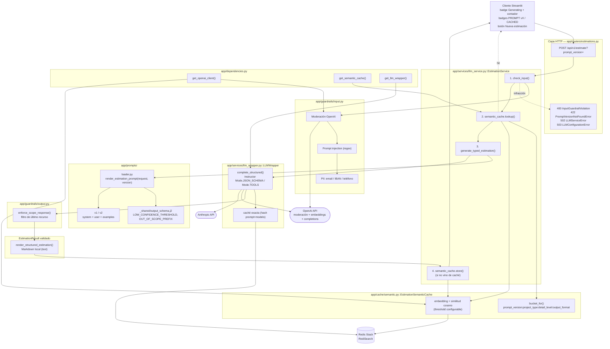

# Estimator CAG - Servicio de Estimacion de Software con IA

Servicio de estimacion de proyectos de software impulsado por IA, utilizando una arquitectura **Cache Augmented Generation (CAG)**.

## Que es CAG y por que lo usamos

CAG (Cache Augmented Generation) es un patron de arquitectura donde el contexto relevante se inyecta directamente en el prompt del LLM como texto estatico. En esta fase del proyecto, las estimaciones de referencia se incluyen como ejemplos dentro del prompt del sistema, sin necesidad de una base de datos vectorial ni busqueda semantica.

Este enfoque es ideal para empezar porque:
- Es simple de implementar y depurar
- No requiere infraestructura adicional (ni embeddings, ni vector stores)
- Funciona bien cuando el volumen de contexto es manejable (pocos ejemplos)

En modulos posteriores del master, este servicio evolucionara a una arquitectura **RAG** (Retrieval Augmented Generation) con base de datos vectorial para manejar un volumen mayor de ejemplos.

## Requisitos previos
- **Docker** y **Docker Compose** instalados
- Una **API key** de OpenAI o Anthropic
- Tener Python instalado


## Inicio rapido con Docker (recomendado)

1. Clonar el repositorio y entrar al directorio:
   ```bash
   cd estimator
   ```

2. Copiar el archivo de variables de entorno y configurar las API keys:
   ```bash
   cp .env.example .env
   # Editar .env y poner tu API key real
   ```

3. Construir y levantar el servicio:
   ```bash
   docker compose up --build
   ```

4. El servicio estara disponible en `http://localhost:8000`

## Alternativa: ejecucion local sin Docker

```bash
uv sync
# Configurar .env con tus API keys
uv run uvicorn app.main:app --reload
```

## Estructura del proyecto

```
estimador-cag/
├── app/
│   ├── main.py            # Aplicacion FastAPI, health check, CORS
│   ├── config.py           # Configuracion con Pydantic Settings
│   ├── routers/
│   │   └── estimations.py  # Endpoint POST /api/v1/estimate
│   ├── services/
│   │   └── llm_service.py  # Logica de negocio, llamadas al LLM
│   ├── schemas/
│   │   └── estimation.py   # Modelos Pydantic (request/response)
│   └── context/
│       └── examples.py     # Ejemplos de estimacion (contexto CAG)
├── tests/
│   └── test_health.py      # Tests basicos
└── pyproject.toml          # Dependencias y configuracion
└── src/estimador_cag       
   └── _init_.py            # este fichero y la carpeta padre me la ha creado la IA para   #resolver un problema que había con los import structlog en varios ficheros
```
## Documentacion interactiva

Con el servicio corriendo, accede a la documentacion Swagger UI en:

- **Swagger UI:** [http://localhost:8000/docs](http://localhost:8000/docs)
- **ReDoc:** [http://localhost:8000/redoc](http://localhost:8000/redoc)

---
## Sesion 3 — LiteLLM, Redis cache, SSE y Streamlit

A partir de la Sesion 3 el servicio incorpora una capa de wrapper sobre el LLM que anade:

- **Fallback de proveedor** (LiteLLM Router) — si el modelo primario falla, se intenta el secundario
- **Cache exact-match** en Redis — la misma transcripcion no vuelve a pagar tokens
- **Streaming SSE** — endpoint `POST /api/v1/estimate/stream` que emite los tokens segun llegan
- **UI Streamlit** — cliente real que consume el endpoint SSE

### Arrancar la stack completa

```bash
cd estimator
docker compose up --build
# La API queda en http://localhost:8000 y Redis en redis://localhost:6379
```

### Probar el endpoint SSE

Demo HTML: abrir [http://localhost:8000/static/sse_demo.html](http://localhost:8000/static/sse_demo.html).

Desde CLI:
```bash
curl -N -X POST http://localhost:8000/api/v1/estimate/stream \
  -H 'Content-Type: application/json' \
  -d '{"transcription": "We need a small CRM with auth, contacts and roles. MVP six weeks."}'
```

### Verificar la cache

```bash
# La misma peticion dos veces — la segunda devuelve cache_hit: true
curl -s localhost:8000/api/v1/estimate -H 'Content-Type: application/json' \
  -d '{"transcription": "We need a small CRM with auth, contacts and roles. MVP six weeks."}' \
  | jq '{cache_hit, cost_usd}'

# Inspeccionar las claves en Redis
docker compose exec redis redis-cli KEYS 'estimation:*'
```

### Streamlit

**Opción A — dentro de Docker Compose** (mismo `docker compose up --build` de arriba, ya
levanta un tercer servicio `streamlit` en `http://localhost:8501`, conectado al `estimator`
por la red interna de Compose):

```bash
docker compose up --build
# Abrir http://localhost:8501
```

**Opción B — ejecutar la API y Streamlit fuera de Docker**, usando Docker solo para Redis:

En `.env`, configura `REDIS_URL=redis://localhost:6379` (es el valor local por defecto;
Compose lo sobrescribe internamente con `redis://redis:6379`). Inicia Redis:

```bash
docker compose up -d redis
```

En una terminal, inicia FastAPI:

```bash
uv run uvicorn app.main:app --reload
```

En otra terminal, inicia Streamlit:

```bash
uv run streamlit run streamlit_app.py
```

Abre `http://localhost:8501`. Streamlit llama a FastAPI en `http://localhost:8000`,
configurado por `ESTIMATOR_API_BASE_URL`. Si Redis ya está instalado localmente, no hace
falta arrancar el servicio Redis de Compose.

---

## Sesion 4 — Contrato tipado, prompts versionados en Jinja2 y frontera anti-inyección

`POST /api/v1/estimate` ya no recibe una transcripción libre: acepta un `EstimationRequest`
tipado (`description`, `project_type`, `detail_level`, `output_format`) y responde con
`EstimationResponse` (`result`, `text`, `prompt_version`, `cached`). El cliente Streamlit expone estos mismos
campos mediante un `st.form`.

Los prompts viven fuera del código Python, versionados por directorio:

```
app/prompts/
├── loader.py                     # render_estimation_prompt(request, version="v1")
└── estimation/
    ├── v1/
    │   ├── system.j2             # rol, formato/detalle condicionales, 
    │   ├── user.j2                # bloque con la descripción del proyecto
    │   └── examples.j2           # 2-3 ejemplos few-shot
    └── v2/                       # variante deliberada: tono directo/ejecutivo + ejemplos propios
        ├── system.j2
        ├── user.j2
        └── examples.j2
```

`render_estimation_prompt` devuelve `(system, user)` como dos mensajes separados
(`role: "system"` / `role: "user"`) — nunca concatenados. El servicio añade instrucciones
de salida estructurada y llama a `LLMWrapper.complete_structured()` con
`response_model=EstimationResult`.

**Instructor + LiteLLM.** Instructor envuelve `litellm.completion`: usa `Mode.JSON_SCHEMA`
para OpenAI y `Mode.TOOLS` para Anthropic. El esquema exige `summary`, `confidence_pct`,
`phases`, `total_duration_weeks` y `total_cost_eur`. Cada `Phase` contiene `name`,
`duration_weeks`, `cost_eur` y `summary`. Los validadores Pydantic exigen la suma exacta
de costes y el prefijo `Out of scope:` si la confianza es inferior al 30 %.
Instructor recibe `max_retries=6` (un intento inicial y hasta seis reintentos).
Si no consigue una respuesta válida, el endpoint devuelve `502` con un mensaje genérico.

El flujo estructurado usa directamente el modelo primario, sin fallback automático.
Su caché Redis está separada de la de texto e incluye el esquema, el modo de Instructor,
los prompts, el modelo y el límite de tokens. Solo guarda resultados validados y vuelve
a validarlos al leerlos. `cached` indica si se reutilizó una respuesta.
`text` se genera localmente a partir del resultado validado, respetando `output_format`,
para mantener Streamlit compatible. El streaming y el flujo antiguo siguen siendo de texto.

**Robustez de scope, en tres capas.** 1) El prompt (`output_schema.j2`) pide
explícitamente declarar `Out of scope:` si `confidence_pct` cae por debajo del
umbral. 2) El `@model_validator` en `EstimationResult` lo exige, forzando a
Instructor a reintentar. 3) `app/guardrails/output.py::enforce_scope_response()`
es la última red: tras validar el resultado, reescribe el caso límite (una
confianza baja sin el prefijo, solo alcanzable si algo muta el objeto tras su
construcción) en una `EstimationResult` de marcador de posición, sin lanzar
nunca una excepción.

**Endpoint y dependencias.** El router recibe `EstimationService` mediante
`Depends(get_estimation_service)` y delega en `service.estimate(request, version=prompt_version)`.
El servicio construye `EstimationResponse`; el router solo traduce errores a HTTP:
`422` para versiones desconocidas o datos invalidos, `502` para fallos de generacion o
validacion y `503` si faltan credenciales. Los errores `502` no exponen detalles internos.
El contrato completo se publica en `/docs` y `/openapi.json`, incluyendo `Phase` y
`EstimationResult`. La fabrica del servicio no resuelve credenciales al arrancar:
el wrapper y Redis siguen usando las fabricas compartidas y se resuelven al estimar.
Las pruebas pueden sustituir el servicio mediante `app.dependency_overrides`.
Pydantic 2.x, Instructor y LiteLLM son dependencias directas del proyecto.

**Guardrails de entrada.** `EstimationService.estimate()` llama a
`app/guardrails/input.py::check_input()` antes de cualquier caché o llamada al LLM, con
tres capas que se detienen en la primera infracción: moderación (OpenAI Moderation API,
se omite sin `OPENAI_API_KEY` y falla abierto si la API no responde), deteccion de
prompt injection (patrones regex) y deteccion de PII (correo, IBAN, telefono). Una
infraccion lanza `InputGuardrailViolation`, que el router traduce a `400` con
`{"reason", "message"}`. El cliente OpenAI usado para moderar se resuelve de forma
perezosa en `get_openai_client()` (`app/dependencies.py`), igual que el resto de
credenciales.

Las dependencias utilizan Instructor 1.x y OpenAI SDK 2.x por compatibilidad. Tras este
cambio de dependencias, Docker requiere reconstruir las imágenes desde este directorio:

```powershell
docker compose up -d --build estimator streamlit
```

**Frontera anti-inyección también en el flujo tipado.** `description` es texto externo, igual
que la transcripción del flujo anterior, así que `render_estimation_prompt` nunca la interpola
cruda: la envuelve con un tag fijo (`app/services/security.py`,
`frame_untrusted_input` / `new_untrusted_data_tag`, compartido con `llm_service.py` para evitar
un import circular con el loader) y añade al `system.j2` una instrucción explícita de que ese
bloque es dato, nunca instrucciones. Cubierto por
[tests/test_prompt_injection_defense.py](tests/test_prompt_injection_defense.py).
El tag fijo mantiene la caché estable, pero es predecible y no impide cierres falsificados.

**Versionado real vía query param.** `POST /api/v1/estimate?prompt_version=v2` selecciona la
variante `v2` (mismo contrato, mismas garantías de seguridad) sin tocar el resto del código; una
versión desconocida devuelve `422` (`PromptVersionNotFoundError`). La respuesta siempre refleja
la versión realmente usada en `prompt_version`.

---

## Sesion 5 — Sesiones y adjuntos PDF/Word (extracción local)

Dos endpoints nuevos, con el estado de sesión en memoria del proceso (`app/sessions.py`,
sin BBDD ni Redis: se pierde al reiniciar el servicio):

- `POST /sessions` → `201 {"session_id": "<uuid v4>"}`. El cliente envía ese id en las
  peticiones posteriores.
- `POST /sessions/{session_id}/estimate` → `EstimationResponse`, igual que
  `/api/v1/estimate`. Acepta `multipart/form-data`:

| Campo | Tipo | Notas |
| --- | --- | --- |
| `transcript` | texto | Obligatorio, 20 a 50.000 caracteres. |
| `attachments` | lista de ficheros | Opcional. PDF o DOCX. |
| `project_type`, `detail_level`, `output_format` | texto | Opcionales; por defecto `web_saas`, `medium`, `phases_table`. |

```bash
curl -s -X POST "http://localhost:8000/sessions/$SESSION_ID/estimate" \
  -F "transcript=We need a customer portal with invoices and reports." \
  -F "attachments=@requisitos.pdf" \
  -F "attachments=@notas.docx"
```

**Qué hace el servicio.** `app/attachments.py` extrae el texto en local (`pypdf` para PDF,
`python-docx` para Word, incluidas las tablas) y lo concatena al `transcript` con un
separador por fichero antes de renderizar el prompt:

```
<transcript>

--- attachment: requisitos.pdf ---
<texto del PDF>

--- attachment: notas.docx ---
<texto del Word>
```

El texto resultante entra en el prompt dentro de la frontera anti-inyección habitual y pasa
por los guardrails de entrada (moderación, inyección, PII) igual que cualquier otra
entrada. Un adjunto con instrucciones maliciosas se rechaza con `400` antes de llegar al LLM.
El nombre del fichero se reduce a su basename sin caracteres de control para que no pueda
falsificar un separador.

**Límites y errores** (configurables en `app/config.py`):

| Caso | Respuesta |
| --- | --- |
| `session_id` desconocido | `404` |
| Extensión distinta de `.pdf` / `.docx` | `415` |
| Fichero mayor de `MAX_ATTACHMENT_BYTES` (10 MB) | `413` |
| Más de `MAX_ATTACHMENTS` (5) ficheros | `422` |
| Fichero corrupto, cifrado o sin texto extraíble | `422` |

Cada fichero se trunca a `MAX_ATTACHMENT_CHARS` (30.000 caracteres) con un aviso explícito
`[attachment truncated at N characters]` en el propio texto.

**Por qué extracción local y no enviar los documentos sin procesar al LLM.**

- **Independencia del proveedor.** El flujo estructurado usa LiteLLM con un modelo primario
  y otro de respaldo de proveedores distintos. Las Files API de OpenAI y Anthropic son
  distintas y cambiar `PRIMARY_MODEL` rompería el soporte de adjuntos. Con texto en el
  prompt, cualquier modelo sirve.
- **Los guardrails actúan sobre texto.** La detección de inyección y de PII son reglas sobre
  texto. Un binario enviado directamente al proveedor eludiría esas defensas y los
  documentos son una vía clásica de inyección indirecta.
- **Coste y contexto acotados.** Con el texto en nuestro lado, el tamaño máximo que entra en
  el prompt es conocido y se limita. Un PDF subido al proveedor se tokeniza como texto e
  imágenes de página, con un coste difícil de predecir.
- **La caché exacta sigue funcionando.** La clave incluye el contenido del prompt; un
  identificador opaco de fichero no permitiría saber si dos peticiones son equivalentes.
- **Privacidad.** No se crean ficheros persistentes en la cuenta del proveedor. El texto sí
  viaja al LLM dentro del prompt.
- **Preparado para chunking.** Texto plano normalizado es la entrada que necesitará el
  troceado de RAG en el módulo 3.
- **Tests sin red.** La extracción se prueba con documentos generados en memoria.

**Qué se pierde.** Diagramas, imágenes y maquetación no llegan al modelo, y un PDF escaneado
sin capa de texto se rechaza (no hay OCR). Tampoco se admite el formato `.doc` antiguo. Si el
caso de uso dependiera de contenido visual, el envío directo a un modelo multimodal sería la
alternativa, a cambio del acoplamiento a un proveedor.

**Memoria de la sesión.** Cada llamada es un turno de la conversación:

- **Historial con ventana deslizante** (`MAX_CONVERSATION_TURNS`, 6 pares usuario/asistente por
  defecto). El system prompt se guarda aparte de los mensajes, así que la ventana nunca lo
  descarta; se vuelve a renderizar en cada turno.
- **`ProjectMetadata`** (`project_name`, `assumed_team_size`, `mentioned_technologies`,
  `agreed_scope`) vive separado del historial y se inyecta en el system prompt como bloque
  `<project_metadata>` (vacío en el primer turno). Tras cada estimación, una segunda llamada
  al LLM (`app/services/metadata_extractor.py`, modelo `METADATA_EXTRACTOR_MODEL`, por defecto
  `gpt-4o-mini`; requiere `OPENAI_API_KEY`) extrae los hechos nuevos: los escalares no nulos
  sobrescriben y las tecnologías se acumulan sin duplicados. Si la extracción falla, se
  conservan los metadatos anteriores y el turno sigue siendo válido.
- **Por qué un extractor LLM y no una heurística.** Una llamada con un prompt corto a un
  modelo barato cuesta muy poco y aguanta mucho mejor las paráfrasis del usuario que unas
  expresiones regulares ("somos cuatro devs", "un equipo de 4 personas"). Con `ProjectMetadata`
  como `response_model`, Instructor valida el resultado y reintenta si no cumple el esquema.
- Como los metadatos los rellena un LLM a partir de texto externo y se reinyectan en cada
  turno, sus campos de texto también se enmarcan como datos no confiables en el prompt.
- Este flujo no usa caché exacta ni semántica: la respuesta depende del historial y no solo
  del transcript. Por eso usa `LLMWrapper.complete_structured_chat`, que recibe la lista de
  mensajes completa.
- Si la estimación falla, ni el historial ni los metadatos se modifican.

**Limitaciones conocidas.** El historial guarda cada mensaje de usuario completo, adjuntos
incluidos, así que varios turnos con ficheros grandes pueden acercarse al límite de contexto
del modelo. Las sesiones no están protegidas frente a peticiones concurrentes sobre el mismo
`session_id`.

Las dependencias `pypdf`, `python-docx` y `python-multipart` son nuevas; hay que reconstruir
la imagen: `docker compose up -d --build estimator streamlit`.

---

## Arquitectura inicial

El servicio sigue una **arquitectura por capas**: cada capa depende únicamente de la inmediatamente inferior, y toda petición atraviesa la misma secuencia HTTP → orquestación → infraestructura LLM → proveedor externo.


Notas sobre este diagrama:
- El endpoint bloqueante (`/api/v1/estimate`) pasa por la capa de negocio completa (prompt, frontera anti-inyección, validación); el de streaming (`/api/v1/estimate/stream`) llama a `LLMWrapper` de forma más directa para poder emitir tokens según llegan.
- `LLMWrapper` es la única pieza que conoce `litellm`; `llm_service.py` depende de esa clase concreta y no de una interfaz abstracta, por lo que **no** es una arquitectura hexagonal (puertos y adaptadores).
- `EstimationCache` y `litellm.Router` son los dos únicos puntos que hablan con sistemas externos (Redis y los proveedores LLM, respectivamente).

---

## Arquitectura final

Tras la Sesion 4, conviven **dos flujos** sobre la misma capa de infraestructura LLM: el
endpoint tipado (`/api/v1/estimate`, prompts en Jinja2 versionados) y el de streaming
(`/api/v1/estimate/stream`, que conserva el flujo CAG original basado en transcripción). Sigue
siendo una **arquitectura por capas** — ningún flujo salta capas ni conoce `litellm` fuera de
`LLMWrapper` — pero ahora la construcción del prompt está desacoplada en su propio módulo
versionado, con una frontera anti-inyección compartida entre ambos flujos.


Qué cambió respecto a la arquitectura inicial:
- **Construcción del prompt desacoplada y versionada**: el flujo tipado ya no arma el prompt con f-strings en `llm_service.py`; `app/prompts/loader.py` renderiza plantillas Jinja2 bajo `estimation/<version>/`, seleccionables vía `?prompt_version=` sin tocar código.
- **Frontera anti-inyección compartida**: `app/services/security.py` (antes vivía dentro de `llm_service.py`) la usan ambos flujos — el tipado envuelve `description` y cada `reference_projects[i].{name,summary}`; el de streaming sigue envolviendo la transcripción.
- **Dos flujos, una sola infraestructura LLM**: ambos terminan en el mismo `LLMWrapper` (cache Redis, fallback de proveedor, coste) — no hay una segunda implementación de llamada al LLM.
- **Docker Compose pasa de 2 a 3 servicios**: `estimator` + `redis` + `streamlit` (antes Streamlit corría solo fuera de Docker).
- Sigue **sin ser hexagonal**: `llm_service.py` y `loader.py` dependen de clases concretas (`LLMWrapper`, `Environment` de Jinja2), no de interfaces/puertos.

---

## Resumen rápido: arrancar y testear

**Levantar la app (recomendado, Docker Compose):**

```bash
cp .env.example .env   # poner tu OPENAI_API_KEY y/o ANTHROPIC_API_KEY
docker compose up --build
```

Levanta tres servicios: `estimator` (API, `http://localhost:8000`, docs en `/docs`),
`redis` (`redis://localhost:6379`) y `streamlit` (`http://localhost:8501`).

**Levantar la app en local sin Docker:**

```bash
uv sync
uv run uvicorn app.main:app --reload   # API en http://localhost:8000
uv run streamlit run streamlit_app.py  # cliente en http://localhost:8501 (otra terminal)
```

**Ejecutar los tests:**

```bash
uv run pytest
```

Toda la suite pasa en verde con este único comando (el mismo que ejecuta la CI en
[.github/workflows/ci.yml](.github/workflows/ci.yml)).

---

## Arquitectura de la aplicación



### Qué se incorporó en esta sesión

- **Datos estructurados y validación (`app/schemas/estimation.py`)**: nuevos modelos
  `Phase` y `EstimationResult`, con dos `@model_validator`: la suma de costes de las
  fases debe coincidir exactamente con `total_cost_eur`, y toda respuesta con
  `confidence_pct < 30` debe empezar por `"Out of scope:"`.
- **Instructor + LiteLLM (`app/services/llm_wrapper.py::complete_structured()`)**:
  genera y valida el JSON estructurado, seleccionando `Mode.JSON_SCHEMA` para OpenAI
  y `Mode.TOOLS` para Anthropic, con hasta 6 reintentos automáticos ante violaciones
  del esquema. Requirió fijar `openai>=2,<3` e `instructor>=1.16,<2` por
  incompatibilidad de versiones.
- **Endpoint y dependencias**: `EstimationService` se inyecta vía
  `Depends(get_estimation_service)`; el router solo traduce errores a HTTP
  (`400/422/502/503`), sin lógica de negocio ni fugas de detalles internos.
- **Robustez de scope en tres capas**: instrucciones explícitas en
  `app/prompts/estimation/_shared/output_schema.j2` (compartidas por `v1` y `v2`,
  parametrizadas con las constantes reales del esquema para que nunca diverjan del
  validador) + el `@model_validator` + `app/guardrails/output.py::enforce_scope_response()`
  como red de seguridad final que nunca lanza excepción.
- **Guardrails de entrada (`app/guardrails/input.py`)**: moderación (OpenAI
  Moderation API, se omite sin clave y falla abierto ante error de red), detección de
  prompt injection y de PII (email, IBAN, teléfono), ejecutados antes de cualquier
  caché o llamada al LLM. Una infracción devuelve `400` con `{reason, message}`.
- **Caché semántica (`app/cache/semantic.py`, `redisvl`)**: clave compuesta por un
  *bucket* determinista (`prompt_version:project_type:detail_level:output_format`) y
  una parte vectorial (embedding de la descripción + similitud coseno, umbral
  configurable). Se consulta tras los guardrails de entrada y solo se escribe con el
  resultado ya filtrado por `enforce_scope_response()`. Requirió migrar el servicio
  `redis` de `docker-compose.yml` a `redis/redis-stack:7.4.0-v0` (RediSearch) y
  aislar las pruebas de ese estado compartido mediante un fixture `autouse` en
  `tests/conftest.py`.
- **Streamlit (`streamlit_app.py`)**: indicador "Generating..." con contador de
  segundos en vivo mientras dura la llamada (hilo en segundo plano, ya que Streamlit
  no refresca durante una llamada bloqueante); badges `PROMPT vX` y `CACHED` sobre el
  resultado; botón "Nueva estimación" que limpia el formulario mediante claves de
  widget versionadas (`form_version`), más fiable que borrar entradas sueltas de
  `session_state` dentro de un `st.form`.


