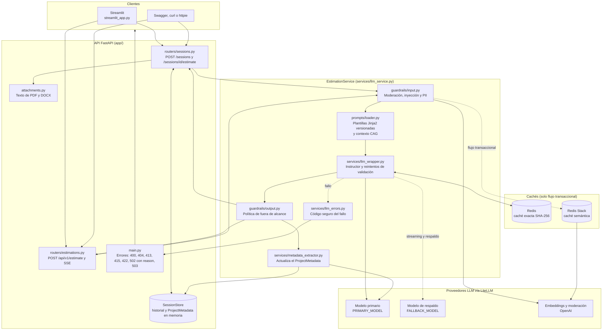

# Estimator CAG - Servicio de Estimacion de Software con IA

Servicio de estimacion de proyectos de software impulsado por IA, utilizando una arquitectura **Cache Augmented Generation (CAG)**.

## Que es CAG y por que lo usamos

CAG (Cache Augmented Generation) es un patron de arquitectura donde el contexto relevante se inyecta directamente en el prompt del LLM como texto estatico. En esta fase del proyecto, las estimaciones de referencia se incluyen como ejemplos dentro del prompt del sistema, sin necesidad de una base de datos vectorial ni busqueda semantica.

Este enfoque es ideal para empezar porque:
- Es simple de implementar y depurar
- No requiere infraestructura adicional (ni embeddings, ni vector stores)
- Funciona bien cuando el volumen de contexto es manejable (pocos ejemplos)

En modulos posteriores del master, este servicio evolucionara a una arquitectura **RAG** (Retrieval Augmented Generation) con base de datos vectorial para manejar un volumen mayor de ejemplos.

## Requisitos previos
- **Docker** y **Docker Compose** instalados
- Una **API key** de OpenAI o Anthropic
- Tener Python instalado


## Inicio rapido con Docker (recomendado)

Desde la carpeta de `estimador-cag`, con Docker Compose.

### 1. Arrancar

```powershell
cd C:\Fuentes\LIDR\estimador-cag
docker compose up -d --build
docker compose ps
```

`--build` es necesario porque hay dependencias nuevas (`pypdf`, `python-docx`,
`python-multipart`). Cuando los tres servicios estén `healthy` o `running`:

- **Streamlit:** http://localhost:8501
- **API y Swagger:** http://localhost:8000/docs

### 2. Qué probar en Streamlit

1. Al cargar la página se crea una sesión; su id aparece en el panel lateral.
2. Escribe una transcripción (mínimo 20 caracteres), adjunta un PDF o Word y pulsa
   **Estimate project**.
3. Haz un segundo turno que añada información, por ejemplo "somos un equipo de 4 y usamos
   Postgres". En el panel lateral se rellena el `project_metadata` y crece el historial.
4. Pulsa **Nueva conversación** para crear otra sesión y vaciar todo.

### 3. Probarlo por API (opcional)

En PowerShell hay que usar `curl.exe`, porque `curl` es un alias de otro comando:

```powershell
$sid = (curl.exe -s -X POST http://localhost:8000/sessions | ConvertFrom-Json).session_id
curl.exe -s -X POST "http://localhost:8000/sessions/$sid/estimate" `
  -F "transcript=We need a customer portal with invoices and reports." `
  -F "attachments=@requisitos.pdf"
curl.exe -s "http://localhost:8000/sessions/$sid"
```

### 4. Si algo falla

- **Logs:** `docker compose logs --since=10m estimator`.
- **Un `502`:** suele ser que `gpt-4o-mini` no consigue que las fases sumen el total. Prueba
  `PRIMARY_MODEL=gpt-4o` en el `.env` y recrea con
  `docker compose up -d --force-recreate estimator`.
- **La metadata no se actualiza:** casi siempre falta `OPENAI_API_KEY` o el modelo del
  extractor no corresponde a tu clave.

### Sin Docker para la API

Deja Redis arrancado con `docker compose up -d redis`, pon `REDIS_URL=redis://localhost:6379`
en el `.env` y lanza en dos terminales `uv run uvicorn app.main:app --reload` y
`uv run streamlit run streamlit_app.py`.

## Alternativa: ejecucion local sin Docker

```bash
uv sync
# Configurar .env con tus API keys
uv run uvicorn app.main:app --reload
```

## Estructura del proyecto

```
estimador-cag/
├── app/
│   ├── main.py                        # FastAPI app, /health y manejadores de error 503 y 502
│   ├── config.py                      # Settings (Pydantic Settings, .env)
│   ├── dependencies.py                # Singletons cacheados: caches, LLMWrapper y SessionStore
│   ├── sessions.py                    # ConversationHistory (ventana), ProjectMetadata, Session, SessionStore
│   ├── attachments.py                 # Extraccion de texto de PDF/DOCX y errores asociados
│   ├── routers/
│   │   ├── estimations.py             # POST /api/v1/estimate y streaming SSE
│   │   └── sessions.py                # POST /sessions, GET /sessions/{id}, POST /sessions/{id}/estimate
│   ├── schemas/
│   │   ├── estimation.py              # EstimationRequest, EstimationResult, EstimationResponse, enums
│   │   └── session.py                 # CreateSessionResponse, SessionInfoResponse
│   ├── services/
│   │   ├── llm_service.py             # EstimationService: guardrails, prompts, llamada estructurada, turno conversacional
│   │   ├── llm_wrapper.py             # LiteLLM + Instructor, fallback, streaming, cost tracking
│   │   ├── llm_errors.py              # Clasifica fallos del LLM en un codigo seguro para el 502
│   │   ├── metadata_extractor.py      # Segunda llamada por turno que actualiza el ProjectMetadata
│   │   ├── cache.py                   # Redis exact-match cache
│   │   ├── evaluation.py              # Utilidades de evaluacion del texto generado
│   │   └── security.py                # Marcado de texto externo como dato (anti prompt injection)
│   ├── guardrails/
│   │   ├── input.py                   # Moderacion, prompt injection y PII
│   │   └── output.py                  # Normalizacion de respuestas de baja confianza
│   ├── cache/
│   │   └── semantic.py                # Cache semantica (bucket + similitud de embeddings)
│   ├── context/
│   │   └── examples.py                # Ejemplos de referencia del contexto CAG
│   ├── prompts/
│   │   ├── loader.py                  # Environment Jinja2 + render_*_prompt
│   │   ├── estimation/
│   │   │   ├── _shared/
│   │   │   │   ├── output_schema.j2        # Contrato de salida compartido
│   │   │   │   └── conversation_context.j2 # Bloque <project_metadata> y aviso de conversacion
│   │   │   ├── v1/                    # system.j2, user.j2, examples.j2
│   │   │   └── v2/                    # system.j2, user.j2, examples.j2
│   │   └── metadata_extraction/
│   │       └── v1/                    # system.j2, user.j2 del extractor de metadata
│   └── static/
│       └── sse_demo.html              # Demo del streaming SSE
├── tests/
│   ├── conftest.py                    # Fixtures compartidas
│   ├── helpers.py                     # Generadores de PDF/DOCX y resultados validos
│   ├── test_sessions*.py              # Sesiones, ventana, metadata y adjuntos (unit, endpoint, contrato, integracion)
│   ├── test_attachments.py
│   ├── test_metadata_extractor.py
│   ├── test_estimate_*.py             # Endpoint de estimacion, prompt_version y streaming
│   ├── test_llm_service.py
│   ├── test_llm_wrapper.py
│   ├── test_llm_errors.py
│   ├── test_guardrails_*.py           # Guardrails de entrada y salida
│   ├── test_prompt_injection_defense.py
│   ├── test_cache_semantic.py
│   ├── test_cag_invariant.py
│   ├── test_examples_format.py
│   ├── test_config.py
│   ├── test_schemas.py
│   ├── test_health.py
│   ├── test_evaluation.py
│   ├── test_streamlit_app.py          # Cliente Streamlit con HTTP simulado
│   └── prompts/                       # test_estimation_v1.py, test_estimation_v2.py, test_conversational.py
├── src/estimador_cag/__init__.py      # Paquete auxiliar
├── streamlit_app.py                   # Cliente: sesion, formulario con adjuntos, panel de metadata
├── test.json                          # Payload de ejemplo para el streaming
├── Dockerfile                         # Multi-stage con uv
├── docker-compose.yml                 # estimator + redis + streamlit
├── pyproject.toml
└── .env.example
```

## Documentacion interactiva

Con el servicio corriendo, accede a la documentacion Swagger UI en:

- **Swagger UI:** [http://localhost:8000/docs](http://localhost:8000/docs)
- **ReDoc:** [http://localhost:8000/redoc](http://localhost:8000/redoc)

---

## Sesion 5 — Sesiones y adjuntos PDF/Word (extracción local)

Tres endpoints nuevos, con el estado de sesión en memoria del proceso (`app/sessions.py`,
sin BBDD ni Redis: se pierde al reiniciar el servicio):

- `POST /sessions` → `201 {"session_id": "<uuid v4>"}`. El cliente envía ese id en las
  peticiones posteriores.
- `GET /sessions/{session_id}` → `session_id`, `message_count`, `max_turns` y el
  `project_metadata` actual (`404` si no existe). Sirve para depurar y para ver la memoria
  separada del historial.
- `POST /sessions/{session_id}/estimate` → `EstimationResponse`, igual que
  `/api/v1/estimate`. Acepta `multipart/form-data`:

| Campo | Tipo | Notas |
| --- | --- | --- |
| `transcript` | texto | Obligatorio, 20 a 50.000 caracteres. |
| `attachments` | lista de ficheros | Opcional. PDF o DOCX. |
| `project_type`, `detail_level`, `output_format` | texto | Opcionales; por defecto `web_saas`, `medium`, `phases_table`. |

```bash
curl -s -X POST "http://localhost:8000/sessions/$SESSION_ID/estimate" \
  -F "transcript=We need a customer portal with invoices and reports." \
  -F "attachments=@requisitos.pdf" \
  -F "attachments=@notas.docx"
```

**Qué hace el servicio.** `app/attachments.py` extrae el texto en local (`pypdf` para PDF,
`python-docx` para Word, incluidas las tablas) y lo concatena al `transcript` con un
separador por fichero antes de renderizar el prompt:

```
<transcript>

--- attachment: requisitos.pdf ---
<texto del PDF>

--- attachment: notas.docx ---
<texto del Word>
```

El texto resultante entra en el prompt dentro de la frontera anti-inyección habitual y pasa
por los guardrails de entrada (moderación, inyección, PII) igual que cualquier otra
entrada. Un adjunto con instrucciones maliciosas se rechaza con `400` antes de llegar al LLM.
El nombre del fichero se reduce a su basename sin caracteres de control para que no pueda
falsificar un separador.

**Límites y errores** (configurables en `app/config.py`):

| Caso | Respuesta |
| --- | --- |
| `session_id` desconocido | `404` |
| Extensión distinta de `.pdf` / `.docx` | `415` |
| Fichero mayor de `MAX_ATTACHMENT_BYTES` (10 MB) | `413` |
| Más de `MAX_ATTACHMENTS` (5) ficheros | `422` |
| Fichero corrupto, cifrado o sin texto extraíble | `422` |

Cada fichero se trunca a `MAX_ATTACHMENT_CHARS` (60.000 caracteres) con un aviso explícito
`[attachment truncated at N characters]` en el propio texto.

**Motivo de los `502`.** Cuando falla la generación, ambos endpoints de estimación devuelven
el mensaje genérico de siempre en `detail` y, además, un campo `reason` con un código fijo:

```json
{
  "detail": "The LLM provider failed to generate the estimation.",
  "reason": {
    "code": "validation_failed",
    "message": "phases sum (23226 EUR) does not match total_cost_eur (23588 EUR); adjust either the phases or the total"
  }
}
```

| `reason.code` | Cuándo | `message` |
| --- | --- | --- |
| `validation_failed` | La respuesta incumple el esquema (suma de costes, `Out of scope:`, límites) | Sí: solo el texto de nuestros validadores |
| `incomplete_response` | JSON cortado o inválido | Sí, fijo |
| `authentication_failed` | Clave inválida o sin acceso al modelo | No |
| `rate_limited` | Cuota o límite de tokens | No |
| `timeout` | Supera `LLM_TIMEOUT` | No |
| `context_too_long` | Historial y adjuntos exceden el contexto | No |
| `provider_unavailable` | Error de conexión o 5xx del proveedor | No |
| `provider_error` | Otro error del proveedor | No |
| `unexpected_error` | Cualquier otro fallo | No |

Nunca se devuelve texto de excepciones del proveedor (puede incluir fragmentos de la clave o
datos de la cuenta): solo el código y, para validación, el mensaje de nuestras reglas sin la
salida del modelo. El detalle completo sigue en el log, en el evento `llm_estimation_failed`.
Streamlit muestra el motivo junto al error. Tests: `tests/test_llm_errors.py`.

**Por qué extracción local y no enviar los documentos sin procesar al LLM.**

- **Independencia del proveedor.** El flujo estructurado usa LiteLLM con un modelo primario
  y otro de respaldo de proveedores distintos. Las Files API de OpenAI y Anthropic son
  distintas y cambiar `PRIMARY_MODEL` rompería el soporte de adjuntos. Con texto en el
  prompt, cualquier modelo sirve.
- **Los guardrails actúan sobre texto.** La detección de inyección y de PII son reglas sobre
  texto. Un binario enviado directamente al proveedor eludiría esas defensas y los
  documentos son una vía clásica de inyección indirecta.
- **Coste y contexto acotados.** Con el texto en nuestro lado, el tamaño máximo que entra en
  el prompt es conocido y se limita. Un PDF subido al proveedor se tokeniza como texto e
  imágenes de página, con un coste difícil de predecir.
- **La caché exacta sigue funcionando.** La clave incluye el contenido del prompt; un
  identificador opaco de fichero no permitiría saber si dos peticiones son equivalentes.
- **Privacidad.** No se crean ficheros persistentes en la cuenta del proveedor. El texto sí
  viaja al LLM dentro del prompt.
- **Preparado para chunking.** Texto plano normalizado es la entrada que necesitará el
  troceado de RAG en el módulo 3.
- **Tests sin red.** La extracción se prueba con documentos generados en memoria.

**Qué se pierde.** Diagramas, imágenes y maquetación no llegan al modelo, y un PDF escaneado
sin capa de texto se rechaza (no hay OCR). Tampoco se admite el formato `.doc` antiguo. Si el
caso de uso dependiera de contenido visual, el envío directo a un modelo multimodal sería la
alternativa, a cambio del acoplamiento a un proveedor.

**Memoria de la sesión.** Cada llamada es un turno de la conversación:

- **Historial con ventana deslizante** (`MAX_CONVERSATION_TURNS`, 6 pares usuario/asistente por
  defecto). El system prompt se guarda aparte de los mensajes, así que la ventana nunca lo
  descarta; se vuelve a renderizar en cada turno.
- **`ProjectMetadata`** (`project_name`, `assumed_team_size`, `mentioned_technologies`,
  `agreed_scope`) vive separado del historial y se inyecta en el system prompt como bloque
  `<project_metadata>` (vacío en el primer turno). Tras cada estimación, una segunda llamada
  al LLM (`app/services/metadata_extractor.py`, modelo `METADATA_EXTRACTOR_MODEL`, por defecto
  `gpt-4o-mini`; requiere `OPENAI_API_KEY`) extrae los hechos nuevos: los escalares no nulos
  sobrescriben y las tecnologías se acumulan sin duplicados. Si la extracción falla, se
  conservan los metadatos anteriores y el turno sigue siendo válido.
- **Por qué un extractor LLM y no una heurística.** Una llamada con un prompt corto a un
  modelo barato cuesta muy poco y aguanta mucho mejor las paráfrasis del usuario que unas
  expresiones regulares ("somos cuatro devs", "un equipo de 4 personas"). Con `ProjectMetadata`
  como `response_model`, Instructor valida el resultado y reintenta si no cumple el esquema.
- Como los metadatos los rellena un LLM a partir de texto externo y se reinyectan en cada
  turno, sus campos de texto también se enmarcan como datos no confiables en el prompt.
- Este flujo no usa caché exacta ni semántica: la respuesta depende del historial y no solo
  del transcript. Por eso usa `LLMWrapper.complete_structured_chat`, que recibe la lista de
  mensajes completa.
- Si la estimación falla, ni el historial ni los metadatos se modifican.

**Variables de entorno de sesiones** (también en `.env.example`):

| Variable | Por defecto | Notas |
| --- | --- | --- |
| `MAX_CONVERSATION_TURNS` | `6` | Pares usuario+asistente que mantiene la ventana. El system prompt no ocupa hueco. |
| `MAX_ATTACHMENT_CHARS` | `60000` | Corte por archivo extraído. Trunca, no rechaza. |
| `METADATA_EXTRACTOR_MODEL` | `gpt-4o-mini` | Modelo de la segunda llamada por turno. |

Lo que llega al LLM en el turno N es `[system] + últimos N pares (user, assistant) + nuevo user`.
El system prompt se regenera en cada turno desde el `ProjectMetadata` actual
(`ConversationHistory.to_messages_list(system_prompt)`), y al superar el tope se descartan
los pares más antiguos en bloque para conservar la alternancia de roles.

**Limitaciones conocidas.** El historial guarda cada mensaje de usuario completo, adjuntos
incluidos, así que varios turnos con ficheros grandes pueden acercarse al límite de contexto
del modelo. Las sesiones no están protegidas frente a peticiones concurrentes sobre el mismo
`session_id`.

**Cliente Streamlit** (`streamlit_app.py`, ya no usa `/api/v1/estimate`):

- Al cargar la página crea una sesión con `POST /sessions` y guarda el `session_id` en
  `st.session_state`; las recargas de la página del navegador crean una nueva.
- El formulario tiene un campo de transcripción, un selector múltiple de ficheros (PDF o
  Word) y las tres opciones de la estimación. Cada envío es un turno de la misma
  conversación y, si va bien, limpia el formulario para el siguiente.
- El panel lateral muestra el `session_id`, el tamaño del historial y el `project_metadata`
  actual (leído con `GET /sessions/{id}`), para ver la memoria separada del historial.
- El botón "Nueva conversación" llama de nuevo a `POST /sessions` y resetea el estado. Si el
  servicio se reinicia y la sesión desaparece, el cliente lo indica y pide pulsarlo.

**Tests de sesiones.** Cada uno equivale a un test del proyecto de referencia
(`ai-engineering`) o cubre un hueco frente a él:

| Tema | Test |
| --- | --- |
| Metadata entre turnos | `tests/test_sessions_integration.py::test_two_requests_in_one_session_update_the_project_metadata` |
| | `tests/test_sessions_estimate_endpoint.py::test_metadata_accumulates_across_turns` |
| | `tests/test_sessions.py::test_merge_overwrites_non_null_scalars_and_keeps_the_rest` |
| | `tests/test_sessions.py::test_merge_unions_technologies_case_insensitively_keeping_order` |
| | `tests/test_sessions.py::test_project_metadata_is_empty_only_without_any_fact` |
| | `tests/test_sessions_contract.py::test_merge_replaces_agreed_scope_with_a_new_non_null_value` |
| | `tests/test_sessions_contract.py::test_a_new_agreed_scope_replaces_the_previous_one_across_turns` |
| Sesiones y 404 | `tests/test_sessions_endpoint.py::test_each_call_creates_a_new_session` |
| | `tests/test_sessions_estimate_endpoint.py::test_unknown_session_is_404_and_does_not_call_the_llm` |
| | `tests/test_sessions_contract.py::test_unknown_session_detail_is_session_not_found` |
| Respuesta | `tests/test_sessions_contract.py::test_the_response_reports_the_prompt_version_and_that_it_is_not_cached` |
| Adjuntos | `tests/test_sessions_estimate_endpoint.py::test_attachments_text_is_appended_to_the_transcript_before_the_prompt` |
| | `tests/test_attachments.py::test_extracts_text_from_a_pdf` |
| | `tests/test_attachments.py::test_extracts_paragraphs_and_table_cells_from_a_docx` |
| | `tests/test_sessions_estimate_endpoint.py::test_unsupported_attachment_type_is_415` |
| | `tests/test_sessions_estimate_endpoint.py::test_attachments_are_optional` |
| | `tests/test_sessions_integration.py::test_a_pdf_attachment_changes_the_estimation` |
| Ventana deslizante | `tests/test_sessions.py::test_window_drops_the_oldest_turns_beyond_max_turns` |
| | `tests/test_sessions.py::test_window_never_exceeds_max_turns_over_many_turns` |
| | `tests/test_sessions_estimate_endpoint.py::test_history_window_keeps_only_the_last_turns_and_the_system_prompt` |
| | `tests/test_sessions_integration.py::test_eight_turns_never_send_more_history_than_the_configured_window` |
| Llamadas al LLM | `tests/test_sessions_contract.py::test_each_turn_makes_one_estimation_call_and_one_metadata_extraction_call` |

Para lanzarlos (incluye el resto de tests de esos ficheros):

```bash
uv run pytest tests/test_sessions.py tests/test_sessions_endpoint.py \
  tests/test_sessions_estimate_endpoint.py tests/test_sessions_integration.py \
  tests/test_sessions_contract.py tests/test_attachments.py -v
```

Las dependencias `pypdf`, `python-docx` y `python-multipart` son nuevas; hay que reconstruir
la imagen: `docker compose up -d --build estimator streamlit`.

---

## Arquitectura 


## Resumen rápido: arrancar y testear

**Levantar la app (recomendado, Docker Compose):**

```bash
cp .env.example .env   # poner tu OPENAI_API_KEY y/o ANTHROPIC_API_KEY
docker compose up --build
```

Levanta tres servicios: `estimator` (API, `http://localhost:8000`, docs en `/docs`),
`redis` (`redis://localhost:6379`) y `streamlit` (`http://localhost:8501`).

**Levantar la app en local sin Docker:**

```bash
uv sync
uv run uvicorn app.main:app --reload   # API en http://localhost:8000
uv run streamlit run streamlit_app.py  # cliente en http://localhost:8501 (otra terminal)
```

**Ejecutar los tests:**

```bash
uv run pytest
```

Toda la suite pasa en verde con este único comando (el mismo que ejecuta la CI en
[.github/workflows/ci.yml](.github/workflows/ci.yml)).

---

## Arquitectura de la aplicación

Hay dos flujos de entrada: el transaccional (`/api/v1/estimate`, con cachés) y el conversacional (`/sessions/{id}/estimate`, con adjuntos, historial y metadata, sin cachés). Ambos pasan por los guardrails de entrada y terminan en el mismo wrapper de LLM.



Resumen de cada flujo:

1. **Transaccional.** Router, guardrails de entrada, caché semántica, plantilla de prompt, wrapper (caché exacta, llamada con Instructor y validadores), guardrails de salida y guardado en ambas cachés.
2. **Conversacional.** Router, extracción de adjuntos, guardrails de entrada sobre el texto completo, prompt con el `<project_metadata>`, llamada con historial en ventana, guardrails de salida, y actualización de historial y metadata con una segunda llamada al LLM. Si la estimación falla no se modifica nada de la sesión.
3. **Errores.** Cualquier fallo del proveedor se clasifica en `reason.code` y se devuelve como `502`; los fallos de configuración, como `503`.


