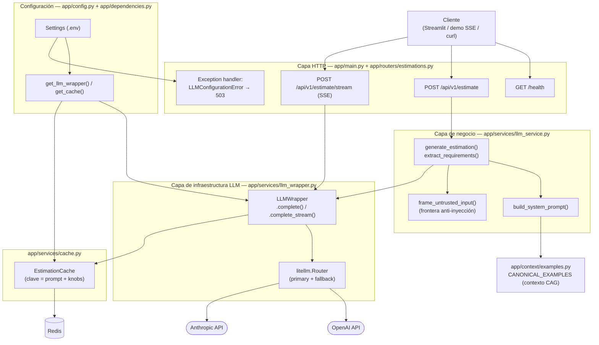
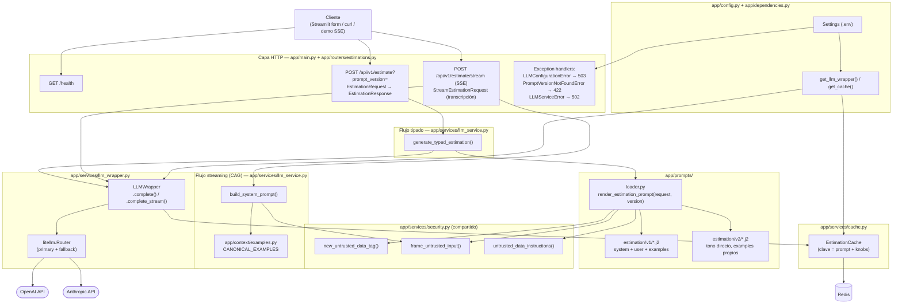

# Estimator CAG - Servicio de Estimacion de Software con IA

Servicio de estimacion de proyectos de software impulsado por IA, utilizando una arquitectura **Cache Augmented Generation (CAG)**.

## Que es CAG y por que lo usamos

CAG (Cache Augmented Generation) es un patron de arquitectura donde el contexto relevante se inyecta directamente en el prompt del LLM como texto estatico. En esta fase del proyecto, las estimaciones de referencia se incluyen como ejemplos dentro del prompt del sistema, sin necesidad de una base de datos vectorial ni busqueda semantica.

Este enfoque es ideal para empezar porque:
- Es simple de implementar y depurar
- No requiere infraestructura adicional (ni embeddings, ni vector stores)
- Funciona bien cuando el volumen de contexto es manejable (pocos ejemplos)

En modulos posteriores del master, este servicio evolucionara a una arquitectura **RAG** (Retrieval Augmented Generation) con base de datos vectorial para manejar un volumen mayor de ejemplos.

## Requisitos previos
- **Docker** y **Docker Compose** instalados
- Una **API key** de OpenAI o Anthropic
- Tener Python instalado


## Inicio rapido con Docker (recomendado)

1. Clonar el repositorio y entrar al directorio:
   ```bash
   cd estimator
   ```

2. Copiar el archivo de variables de entorno y configurar las API keys:
   ```bash
   cp .env.example .env
   # Editar .env y poner tu API key real
   ```

3. Construir y levantar el servicio:
   ```bash
   docker compose up --build
   ```

4. El servicio estara disponible en `http://localhost:8000`

## Alternativa: ejecucion local sin Docker

```bash
uv sync
# Configurar .env con tus API keys
uv run uvicorn app.main:app --reload
```

## Estructura del proyecto

```
estimador-cag/
├── app/
│   ├── main.py            # Aplicacion FastAPI, health check, CORS
│   ├── config.py           # Configuracion con Pydantic Settings
│   ├── routers/
│   │   └── estimations.py  # Endpoint POST /api/v1/estimate
│   ├── services/
│   │   └── llm_service.py  # Logica de negocio, llamadas al LLM
│   ├── schemas/
│   │   └── estimation.py   # Modelos Pydantic (request/response)
│   └── context/
│       └── examples.py     # Ejemplos de estimacion (contexto CAG)
├── tests/
│   └── test_health.py      # Tests basicos
└── pyproject.toml          # Dependencias y configuracion
└── src/estimador_cag       
   └── _init_.py            # este fichero y la carpeta padre me la ha creado la IA para   #resolver un problema que había con los import structlog en varios ficheros
```
## Documentacion interactiva

Con el servicio corriendo, accede a la documentacion Swagger UI en:

- **Swagger UI:** [http://localhost:8000/docs](http://localhost:8000/docs)
- **ReDoc:** [http://localhost:8000/redoc](http://localhost:8000/redoc)

---
## Sesion 3 — LiteLLM, Redis cache, SSE y Streamlit

A partir de la Sesion 3 el servicio incorpora una capa de wrapper sobre el LLM que anade:

- **Fallback de proveedor** (LiteLLM Router) — si el modelo primario falla, se intenta el secundario
- **Cache exact-match** en Redis — la misma transcripcion no vuelve a pagar tokens
- **Streaming SSE** — endpoint `POST /api/v1/estimate/stream` que emite los tokens segun llegan
- **UI Streamlit** — cliente real que consume el endpoint SSE

### Arrancar la stack completa

```bash
cd estimator
docker compose up --build
# La API queda en http://localhost:8000 y Redis en redis://localhost:6379
```

### Probar el endpoint SSE

Demo HTML: abrir [http://localhost:8000/static/sse_demo.html](http://localhost:8000/static/sse_demo.html).

Desde CLI:
```bash
curl -N -X POST http://localhost:8000/api/v1/estimate/stream \
  -H 'Content-Type: application/json' \
  -d '{"transcription": "We need a small CRM with auth, contacts and roles. MVP six weeks."}'
```

### Verificar la cache

```bash
# La misma peticion dos veces — la segunda devuelve cache_hit: true
curl -s localhost:8000/api/v1/estimate -H 'Content-Type: application/json' \
  -d '{"transcription": "We need a small CRM with auth, contacts and roles. MVP six weeks."}' \
  | jq '{cache_hit, cost_usd}'

# Inspeccionar las claves en Redis
docker compose exec redis redis-cli KEYS 'estimation:*'
```

### Streamlit

**Opción A — dentro de Docker Compose** (mismo `docker compose up --build` de arriba, ya
levanta un tercer servicio `streamlit` en `http://localhost:8501`, conectado al `estimator`
por la red interna de Compose):

```bash
docker compose up --build
# Abrir http://localhost:8501
```

**Opción B — fuera de Docker**, consumiendo el backend por HTTP:

```bash
cd estimator
uv sync
uv run streamlit run streamlit_app.py
# Abrir http://localhost:8501
```

La URL del backend se lee de `ESTIMATOR_API_BASE_URL` (default `http://localhost:8000`; el
servicio `streamlit` de Compose la sobrescribe a `http://estimator:8000`).

---

## Sesion 4 — Contrato tipado, prompts versionados en Jinja2 y frontera anti-inyección

`POST /api/v1/estimate` ya no recibe una transcripción libre: acepta un `EstimationRequest`
tipado (`description`, `project_type`, `detail_level`, `output_format`) y responde con
`EstimationResponse` (`text`, `prompt_version`). El cliente Streamlit expone estos mismos
campos mediante un `st.form`.

Los prompts viven fuera del código Python, versionados por directorio:

```
app/prompts/
├── loader.py                     # render_estimation_prompt(request, version="v1")
└── estimation/
    ├── v1/
    │   ├── system.j2             # rol, formato/detalle condicionales, 
    │   ├── user.j2                # bloque con la descripción del proyecto
    │   └── examples.j2           # 2-3 ejemplos few-shot
    └── v2/                       # variante deliberada: tono directo/ejecutivo + ejemplos propios
        ├── system.j2
        ├── user.j2
        └── examples.j2
```

`render_estimation_prompt` devuelve `(system, user)` como dos mensajes separados
(`role: "system"` / `role: "user"`) — nunca concatenados — y sigue despachándolos a través
del mismo `LLMWrapper` de la Sesion 3 (cache, fallback y coste no cambian).

**Frontera anti-inyección también en el flujo tipado.** `description` es texto externo, igual
que la transcripción del flujo anterior, así que `render_estimation_prompt` nunca la interpola
cruda: la envuelve con un tag aleatorio por petición (`app/services/security.py`,
`frame_untrusted_input` / `new_untrusted_data_tag`, compartido con `llm_service.py` para evitar
un import circular con el loader) y añade al `system.j2` una instrucción explícita de que ese
bloque es dato, nunca instrucciones. Cubierto por
[tests/test_prompt_injection_defense.py](tests/test_prompt_injection_defense.py).

**Versionado real vía query param.** `POST /api/v1/estimate?prompt_version=v2` selecciona la
variante `v2` (mismo contrato, mismas garantías de seguridad) sin tocar el resto del código; una
versión desconocida devuelve `422` (`PromptVersionNotFoundError`). La respuesta siempre refleja
la versión realmente usada en `prompt_version`.

---

## Arquitectura inicial

El servicio sigue una **arquitectura por capas**: cada capa depende únicamente de la inmediatamente inferior, y toda petición atraviesa la misma secuencia HTTP → orquestación → infraestructura LLM → proveedor externo.



Notas sobre este diagrama:
- El endpoint bloqueante (`/api/v1/estimate`) pasa por la capa de negocio completa (prompt, frontera anti-inyección, validación); el de streaming (`/api/v1/estimate/stream`) llama a `LLMWrapper` de forma más directa para poder emitir tokens según llegan.
- `LLMWrapper` es la única pieza que conoce `litellm`; `llm_service.py` depende de esa clase concreta y no de una interfaz abstracta, por lo que **no** es una arquitectura hexagonal (puertos y adaptadores).
- `EstimationCache` y `litellm.Router` son los dos únicos puntos que hablan con sistemas externos (Redis y los proveedores LLM, respectivamente).

---

## Arquitectura final

Tras la Sesion 4, conviven **dos flujos** sobre la misma capa de infraestructura LLM: el
endpoint tipado (`/api/v1/estimate`, prompts en Jinja2 versionados) y el de streaming
(`/api/v1/estimate/stream`, que conserva el flujo CAG original basado en transcripción). Sigue
siendo una **arquitectura por capas** — ningún flujo salta capas ni conoce `litellm` fuera de
`LLMWrapper` — pero ahora la construcción del prompt está desacoplada en su propio módulo
versionado, con una frontera anti-inyección compartida entre ambos flujos.



Qué cambió respecto a la arquitectura inicial:
- **Construcción del prompt desacoplada y versionada**: el flujo tipado ya no arma el prompt con f-strings en `llm_service.py`; `app/prompts/loader.py` renderiza plantillas Jinja2 bajo `estimation/<version>/`, seleccionables vía `?prompt_version=` sin tocar código.
- **Frontera anti-inyección compartida**: `app/services/security.py` (antes vivía dentro de `llm_service.py`) la usan ambos flujos — el tipado envuelve `description` y cada `reference_projects[i].{name,summary}`; el de streaming sigue envolviendo la transcripción.
- **Dos flujos, una sola infraestructura LLM**: ambos terminan en el mismo `LLMWrapper` (cache Redis, fallback de proveedor, coste) — no hay una segunda implementación de llamada al LLM.
- **Docker Compose pasa de 2 a 3 servicios**: `estimator` + `redis` + `streamlit` (antes Streamlit corría solo fuera de Docker).
- Sigue **sin ser hexagonal**: `llm_service.py` y `loader.py` dependen de clases concretas (`LLMWrapper`, `Environment` de Jinja2), no de interfaces/puertos.

---

## Resumen rápido: arrancar y testear

**Levantar la app (recomendado, Docker Compose):**

```bash
cp .env.example .env   # poner tu OPENAI_API_KEY y/o ANTHROPIC_API_KEY
docker compose up --build
```

Levanta tres servicios: `estimator` (API, `http://localhost:8000`, docs en `/docs`),
`redis` (`redis://localhost:6379`) y `streamlit` (`http://localhost:8501`).

**Levantar la app en local sin Docker:**

```bash
uv sync
uv run uvicorn app.main:app --reload   # API en http://localhost:8000
uv run streamlit run streamlit_app.py  # cliente en http://localhost:8501 (otra terminal)
```

**Ejecutar los tests:**

```bash
uv run pytest
```

Toda la suite pasa en verde con este único comando (el mismo que ejecuta la CI en
[.github/workflows/ci.yml](.github/workflows/ci.yml)).


